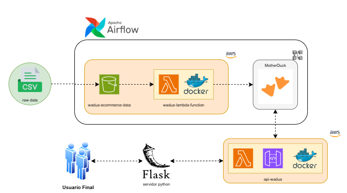

# Data Pipeline con AWS, Airflow y MotherDuck


Este proyecto implementa un **pipeline de datos en la nube** que procesa archivos desde **AWS S3**, aplica validaciones y transformaciones mediante **AWS Lambda**, almacena datos procesados en **MotherDuck (DuckDB en la nube)** y expone resultados a través de una API con **API Gateway**.  
La orquestación del flujo está gestionada con **Apache Airflow** y el despliegue se realiza dentro de **Docker**.

---

## 🔄 Flujo de trabajo

1. **Carga de archivos** → Se suben archivos raw (ej: orders) a un bucket en **S3**.  
2. **Detección con Airflow** → Una tarea en **Airflow** valida si hay nuevos archivos en S3.  
3. **Procesamiento en Lambda** → Si hay archivos nuevos:
   - Se extraen los datos.
   - Se validan y transforman.
   - Se insertan en **MotherDuck**.
   - Se generan **logs** que se guardan en S3.  
4. **Exposición de resultados** → Los datos procesados pueden consultarse vía:
   - **API Gateway** (integración con Lambda).  
5. **Notificaciones** → Se envían alertas por **SNS o email** en caso de errores.

---

## Diagrama del Workflow




---

## ⚙️ Requerimientos

- **Docker y Docker Compose** instalados.  
- **Cuenta de AWS** con permisos para:
  - S3  
  - Lambda  
  - API Gateway  
- **Credenciales AWS** configuradas (`~/.aws/credentials`).  
- Dependencias necesarias:
  - `pandas`  
  - `boto3`  
  - `duckdb`  
  - `sqlalchemy`  


## Correr este proyecto localmente

1. Clonar el repositorio:

   ```bash
   git clone https://github.com/saalesgu/wadua-ETL-ecommerce.git
   cd wadua-ETL-ecommerce
   ```

2. Levantar los servicios con Docker

   ```bash
   docker-compose up -d
   ```

3. Acceder a Airflow en `http://localhost:8080`

# 📂 Estructura del Proyecto

```plaintext
WADUA-PROYECTO/
├── api-wadua/                    # Código relacionado con la API Lambda
│   ├── Dockerfile                # Imagen Docker para desplegar Lambda
│   ├── lambda_function.py        # Función principal Lambda
│   └── requirements.txt          # Dependencias de la Lambda
│
├── dags/                         # Definición de DAGs en Airflow
│   └── wadua-dag/
│       ├── __pycache__/          # Archivos compilados de Python
│       ├── dag.py                # Definición principal del DAG
│       └── etl.py                # Lógica ETL usada en el DAG
│
├── data/                         # Espacio para almacenar datasets o archivos temporales
│
├── lambda-wadua/                 # Otro paquete Lambda (independiente)
│   ├── Dockerfile
│   ├── lambda_function.py
│   └── requirements.txt
│
│
├── notebooks/                    # Jupyter Notebooks para análisis exploratorio
│   └── 01-EDA.ipynb              # Análisis de datos inicial
│
├── server/                       # Servidor backend (Flask)
│   ├── static/                   # Archivos estáticos (CSS, JS, imágenes)
│   ├── templates/                # Plantillas HTML (Jinja2, etc.)
│   └── app.py                    # Entrada principal del servidor web
│
├── .gitignore                    # Archivos/carpetas ignoradas en git
├── docker-compose.yml            # Orquestación de contenedores
├── README.md                     # Documentación principal del proyecto
└── requirements.txt              # Dependencias principales del proyecto
```

---

Gracias por tomarte el tiempo de explorar este proyecto. El objetivo es seguir mejorando la arquitectura y optimizando los flujos de datos para que esta solución sirva como base en futuros desarrollos.  

Si tienes ideas, comentarios o sugerencias, no dudes en compartirlos.  

¡Toda contribución es bienvenida y valorada! 🙌  